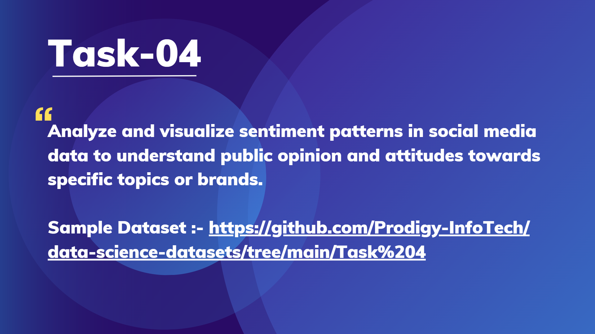

# PRODIGY_DS_04  
## Prodigy InfoTech – Data Science Internship (Task 4)  

  

Hi there!  
I'm **RITHIK CA**, and this repository contains my submission for **Task 4** of the **Prodigy InfoTech Data Science Internship**. In this task, I performed **Sentiment Analysis** on social media data and created **visualizations** to understand sentiment trends and patterns across different topics.  

---

## 📋 Problem Statement  
The objective is to analyze and visualize the sentiment expressed in social media posts to gain insights into **public opinion**, **customer attitudes**, and **brand perception**. The goal is to classify sentiments (positive, negative, neutral) and identify trends that can guide businesses in making informed decisions.  

---

## 🌍 About the Dataset  
The dataset contains **social media text data** related to specific topics and brands. Each entry represents a user post or message with associated metadata.  

**Key aspects of the dataset:**  
- Text data for sentiment classification  
- Various topics and message lengths for pattern analysis  

*(Dataset sourced for educational purposes.)*  

---

## 🛠 Tools & Libraries  
- **Python (Jupyter Notebook)**  
- `pandas`, `numpy` – Data manipulation and analysis  
- `matplotlib`, `seaborn` – Data visualization  
- `NLTK` & `VADER` – Sentiment analysis (NLP techniques)  
- `wordcloud` – Word cloud generation  

---

## 🔍 Workflow Overview  

### 1. Data Exploration  
- Loaded and examined dataset structure  
- Checked for missing values and basic statistics  
- Analyzed distribution of text lengths  

### 2. Data Cleaning & Preprocessing  
- Removed unnecessary characters, punctuation, and stop words  
- Tokenized and normalized text data  
- Prepared data for sentiment scoring  

### 3. Sentiment Analysis  
- Implemented **VADER (Valence Aware Dictionary for Sentiment Reasoning)** for sentiment classification  
- Classified posts into **Positive**, **Negative**, and **Neutral** categories  

### 4. Visualization  
- **Histogram:** Distribution of sentiment scores  
- **Donut Chart:** Proportion of positive, negative, and neutral sentiments  
- **Word Clouds:** Most frequent words for each sentiment category  

---

## 💡 Key Insights  
- Majority of posts expressed **neutral or positive sentiments**, with negative posts forming a smaller proportion.  
- Certain keywords strongly correlated with **negative sentiments**, highlighting potential areas for brand improvement.  
- Visualization of word frequency helped identify **trending topics** within each sentiment group.

- Sentiments
Neutral       816
Negative      748
Positive      573
Irrelevant    167
Name: count, dtype: int64

---

## 📊 Visualizations  
- **Sentiment Distribution (Donut Chart)**  
- **Top Words (Word Cloud)**  
- **Histogram of Sentiment Scores**  

*(All plots are available in the notebook.)*  

---

## 🎯 Conclusion  
This project demonstrates how **Natural Language Processing (NLP)** and **data visualization** can be used to extract actionable insights from social media data. Businesses can leverage such analysis for **brand monitoring**, **customer feedback analysis**, and **strategic decision-making**.  

---

**Thank you for visiting!** 😊  
For questions or suggestions, feel free to open an issue or reach out.  

🔗 **GitHub Repository:** [Click Here](https://lnkd.in/dvKjyA_C)  
